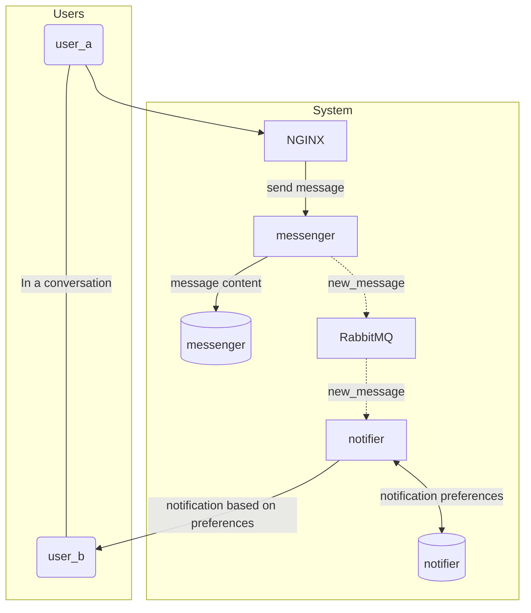

# Microservices March Demo Architecture

This is a continuosly evolving demo architecture for the annual Microservices March NGINX event. The architecture consists of a simple chat system in which each "conversation" has two users (think LinkedIn messages).

## Microservices March 2023
The Microservices March 2023 event has finished.  You can view the materials which include video and text-based tutorials at [this link](https://www.nginx.com/c/microservices-march-2023-agenda/).  All of the tutorials use tag `v1` as a base, although some start from other branches but it will be noted in the lab guides.

The instruqt-based interactive labs are no longer available.

## Running the Architecture

We suggest you read and understand this document before continuing. Start up instructions can be found in the [`platform` repository README](https://github.com/microservices-march/platform).

## Goals

- Be understandable to learners of various backgrounds and experience levels
- Show common microservices concepts using a very simple approach
- Show how the organization of your teams needs to be considered together with the arrangement of your services
- Be reasonably similar to what you might see at a medium-sized SaaS company

## Non-Goals

- To be a production-ready example
- To provide perfect or prescriptive solutions
- To use the newest technologies

## Design Principles

### Teach Foundational Concepts and Decisionmaking

This demo architecture is NOT meant to be an example of a production-ready application architecture. Instead, its primary goal is to illustrate the challenges of a microservice architecture in their most basic form.

Reasons for the inclusion of tooling and of decisions made around common issues shall be described in terms of the decisionmaking criteria behind them and the core problems being solved. Through study of this demo, one should be able to make decisions about their own architecture rather than copying patterns blindly.

### Simplicity

This demo does not use any complex container orchestration systems such as Kubernetes or Nomad, nor does it use other supporting frameworks like service meshes.

Although these are necessary if you want to deploy microservices in any serious capacity, they hide key concepts and it's easy to get caught up in the quirks of their configuration languages and implementations.

Docker is used because it is widely known and we can explicitly show network configurations. Pains will be taken to explain Docker based setups as much as possible without assuming any previous knowledge on the part of the user.

### Understandablity

Examples are presented in the smallest set of technologies possible, and the most commonly used technologies have been chosen.

Applications have been written to colocate the non-boilerplate code as much as possible so that in most cases it should only take reading a single, main file to understand what a given application is doing.

Heavy frameworks have been avoided and any database interaction is presented in raw SQL for maximum clarity.

## System Overview

The demo architecture is a basic messaging application in which two users can exchange messages. A user will receive notifications about new messages. The functionality is similar to that of LinkedIn messaging.

There are two backend services, [`notifier`](https://github.com/microservices-march/notifier) and [`messenger`](https://github.com/microservices-march/messenger).

Each service has its own PostgreSQL database.

There is a single RabbitMQ message queue that any service can use. It is defined in the [`platform`](https://github.com/microservices-march/platform) repository.

| Service     | Role                                                                                                                                    |
|-------------|-----------------------------------------------------------------------------------------------------------------------------------------|
| `messenger` | Provides the HTTP interface for sending and receiving messages used both by programmatic access and a potential UI. Stores messages.    |
| `notifier`  | Listens for `new_message` events on the message queue. Stores user notification preferences and dispatches notifications.               |

| Infrastructure | Role                                                                                                                                 |
|----------------|--------------------------------------------------------------------------------------------------------------------------------------|
| `RabbitMQ`     | Services can broadcast events and other services can consume those messages and act accordingly. Serves as a messaging queue/broker. |
| `NGINX`        | Routes HTTP traffic from outside the system to the correct service.                                                                  |

### System Diagram

The above diagram illustrates the following basic flow (given `user_a` and `user_b` being in a `conversation` together):

1. `user_a` sends a message to `user_b`
2. The message is routed to the `notifier` service by the `NGINX` load balancer
3. The message is saved in the database
4. The `messenger` service produces the `new_message` event to `RabbitMQ`
5. The `notifier` service, which is consuming data from `RabbitMQ` processes the `new_message` event
6. The `notifier service checks its database to find the notification preferences for `user_b`
7. The `notifier` service dispatches the notification about the new message to `user_b` (shown via logs from `notifier`)
