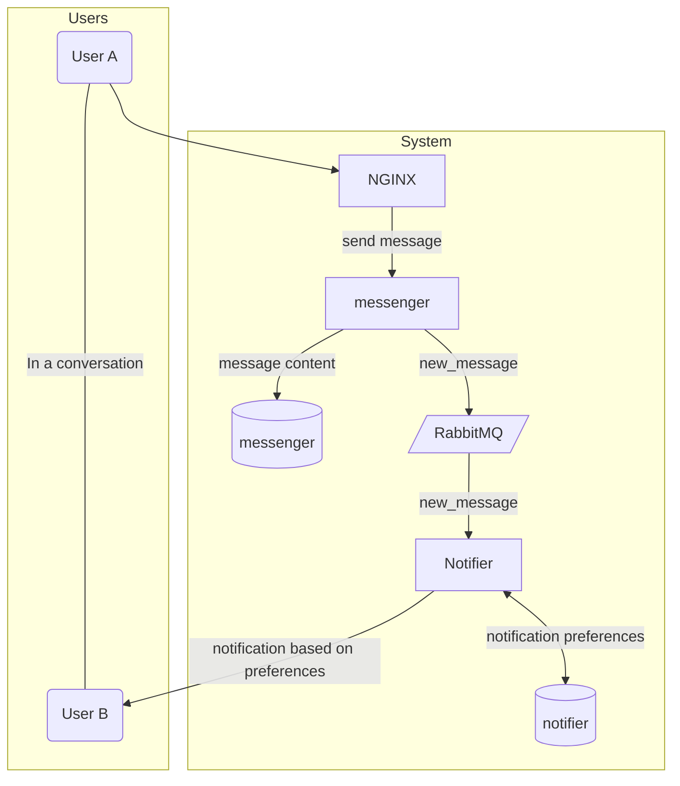

# Microservices March Demo Architecture
This is the work-in-progress demo architecture for an event. The system is a simple chat system in which each "conversation" has two users (think LinkedIn messages).

## Goals
* Be understandable to learners of various backgrounds and experience levels
* Show common microservices concepts using a very simple approach
* Show how the organization of your teams needs to be considered together with the arrangement of your services
* Be reasonably similar to what you might see at a medium-size SaaS company

## Non-Goals
* To be a production-ready example
* To provide perfect or prescriptive solutions
* To use the newest technology

## Design Principles
### Teach Foundational Concepts and Decisionmaking
This demo architecture is NOT meant to be an example of a production-ready application architecture.  Instead, it's primary goal is to illustrate the challenges of a microservice architecture in their most basic form.

Reasons for the inclusion of tooling, or of decisions made around common issues shall be described in terms of the decisionmaking criteria behind them and the core problems that are being solved. Through study of this demo, one should be able to make decisions about their own architecture rather than copying patterns blindly.

### Simplicity
This demo does not use any complex container orchestration systems such as Kubernetes or Nomad - nor does it use other supporting frameworks like service meshes.

Although these are necessary if you want to deploy microservices in any serious capacity - they hide key concepts and it's easy to get caught up in the quirks of their configuration languages and implementations.

Docker is used because it is widely known and we can explicitly show network configurations.  Pains will be taken to explain docker-based setups as much as possible without assuming knowledge on tha part of the user.

### Understandablity
Examples are presented in the smallest set of technologies possible, and the most commonly used technologies have been chosen.

Applications have been written to colocate the non-boilerplate code as much as possible so that in most cases it should only take reading a single, main file to understand what a given application is doing.

Heavy frameworks have been avoided and any database interaction is presented in raw SQL for maximum clarity.

## Getting Started

## System Overview
This demo describes a simple architecture that has two backend services.
| Service     | Role                                                                                                                                    |
|-------------|-----------------------------------------------------------------------------------------------------------------------------------------|
| `messenger` | * Provides the HTTP interface for sending and receiving messages used both by programmatic access and an eventual UI. * Stores messages |
| `notifier`  | * Listens for `new_message` events on the message queue * Stores user notification preferences * Dispatches notifications               |

